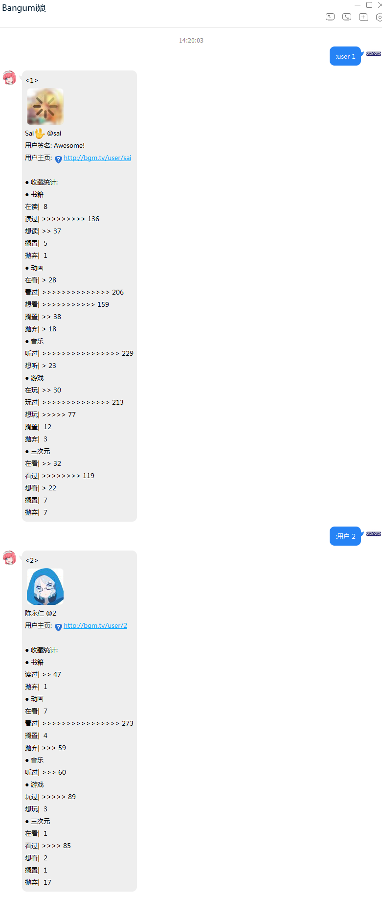
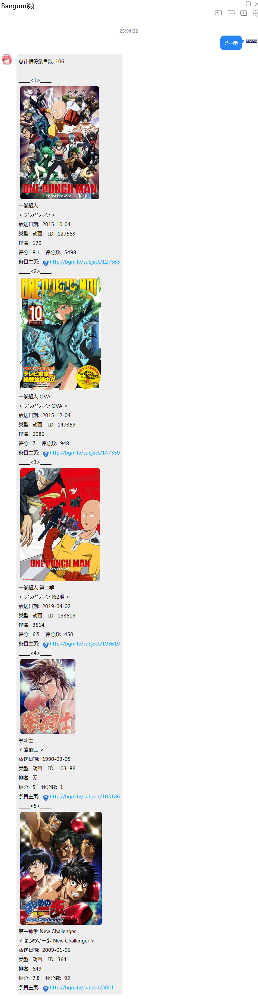
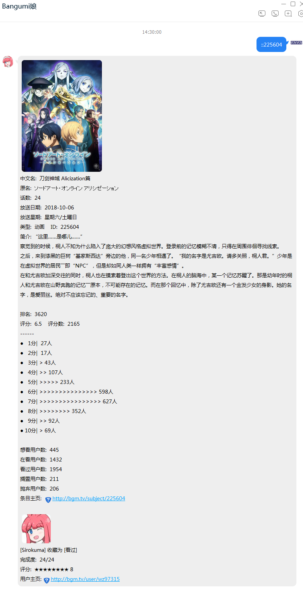
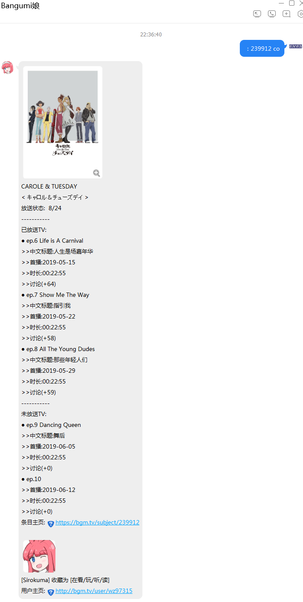

# Bangumi娘使用指南
# 1. 简介与用途
Bangumi QQ机器人简称[Bangumi娘][1]，是为方便Bangumi用户进行分享，交流，收藏与更新动画进度等而开发的QQ机器人。
# 2. 基础指南
- 一切可识别的指令以**中文或英文**下的`冒号「:」`或`分号「;」(刷新缓存)`开头，可以一条消息中使用多种指令，对于一些指令本身也支持多个参数的识别。
+ 多个指令之间的连接符有`冒号「:」`，`分号「;」`，`等号「=」`和`反斜杠「\」`但是需要**注意**用于连接符的冒号和分号**只能是英文下**的，否则只会被看成是一个参数。
+ 一个指令可以批量参数执行，比如你希望查询两个ID的条目，你可以只使用一个指令符和两个参数即可，连接两个参数之间的符号叫参数连接符
，它只包括`空格「 」`，另外`指令关键字`也可以充当一个参数连接符。
+ 机器人使用了缓存机制，但当使用两个**英文**下的冒号即`「::」`发起指令时，即消息开头的前缀，则消息中所有指令会请求最新的数据而非缓存的数据，但速度上会相对慢一点，也就是说此操作会导致此消息中所有的指令都不使用缓存。
+ **注意:** 因为参数分割符包括`空格`，因此请务必注意一个参数中间不能出现空格。
+ **注意:** 所有的指令的识别是从`前缀(也就是分号冒号那些)`开始找到的第一个与已有的指令匹配的字符决定，也就是说你的参数与指令没有绝对的位置关系，但你的参数中可能包含指令的字符，这时你就需要先将你需要的指令的关键字尽量放在`前缀`后面。
+ **注意:** 一条指令只会将第一个出现的指令作为此指令的功能，也就是说一旦指令已经被识别出来，这条指令之后的参数中出现的指令关键字都会作为参数处理而不是指令。
+ 当前机器人使用的指令识别符有`user/用户(用户查询)`，`acg/条目/查询(条目查询)`，`?/？/搜索(条目搜索)`，`reg/绑定(用户绑定)`，`co/收藏(条目收藏)`，`up/++/更新(条目更新)`，`tag/标签（标签搜索）`
和`rank/统计（统计使用情况）`，另外指令不分大小写，也就是说任意大小写都可以被识别。

|指令关键字|指令含意|参数[括号内可部分或全部缺省]|参数举例|高级参数举例|
| ----  | ----  | ----  | ----  | ----  |
| "user" "用户" | 进行用户信息查询 |<用户ID>|123|无|
| "<空>" "acg" "条目" "查询" | 进行条目信息查询 |<条目ID>(/<条目额外信息标识符>)|22023|22023/t|
| "?" "？" "搜索" | 进行条目搜索 |<搜索关键字>(/<条目类型>/<条目个数>/<起始条目下标>)|英雄|英雄/x/8/2|
| "reg" "绑定" | 将QQ号与Bangumi账号绑定 |无|无|无|
| "co" "收藏" | 进行条目的收藏 |<条目ID>(/<收藏类型>/<评分>/<吐槽>/<标签1>+<标签2>...)|123456|123456/fin/8/制作精良/原创+热血|
| "up" "++" "更新" | 进行条目的更新 |<条目ID>(/<要更新的进度>...)|21435|21435/air|
| "tag" "标签" | 此指定标签的条目搜索 |(<标签关键字>)(/<放送季度>/<页码>)|原创动画作品|原创动画作品/2019-01/2|
| "rank" "统计" | 统计指令使用情况 |<空> 或 "me"|me|无|
| "tml" "时光机" | 查询用户或全站时间线 |<空> 或 <用户ID>|sai|无|
| "bgm" "bangumi" | 查询用户收藏列表 |<用户ID>(/<条目类型>/<收藏类型>/<页码>/<排序方式>/<标签>)| 1| #/a/fin/1/rate/原创|

|<条目ID>|含意|参数[括号内可部分或全部缺省]|参数举例|高级参数举例|
| ----  | ----  | ----  | ----  | ----  |
| <数字> | 原生的条目ID|无|123|无|
| "#" | 从数据库中查找指定关键字的条目ID|<搜索关键字>(-<条目下标>)|#一拳超人|#一拳超人-2|
| "%" | 从Bangumi中查找指定关键字的条目ID|<搜索关键字>(\*<条目类型>\*<条目下标>)|%一拳超人|%一拳超人\*a\*2|
| <空> | 返回上次查询，更新或收藏的条目ID|无|<空>|无|

|<用户ID>|含意|参数举例|
| ----  | ----  | ----  |
| "#" | QQ号关联的Bangumi账号 | "#" |
| <数字> | Bangumi账号的数字UID | 1 |
| <用户名> | Bangumi账号的自定义字母数字组合UID | sai |

|<条目额外信息标识符>(不区分大小写)|对应的信息|
| ----  | ----  |
| t | 此条目的标签 |
| r | 此条目的角色 |
| c | 此条目的吐槽 |
| s | 此条目的放送状态 |
| o | 此条目的staff信息 |
| a | 此条目的关联条目 |

|<条目类型>(不区分大小写)|对应的条目类型|
| ----  | ----  |
|a (默认)  | 动画 |
|c  | 书籍 |
|g  | 游戏 |
|m  | 音乐 |
|r  | 三次元 |
|x (bgm指令中无效)  | 全部分类 |

|<收藏类型>(不区分大小写)|对应的收藏状态|
| ----  | ----  |
|"do" "on" (默认)  | 在看/玩/听/读 |
|"collect" "fin"  | 看/玩/听/读过 |
|"wish" "td"  | 想看/玩/听/读 |
|"hold"  | 搁置 |
|"drop"  | 抛弃 |

|<要更新的进度>|对应进度|
| ----  | ----  |
| <数字> | 此数字的大小 |
| "air" | 已放送话数 |
| "fin"  | 总话数(同时会收藏为看过状态) |
| +x  | 在自己进度基础上向后加上 x 话 |
| -x  | 在自己进度基础上向前减去 x 话 |
| (数/参)+x  | 在原有的数字和参数表示基础上向后加上 x 话 |
| (数/参)-x  | 在原有的数字和参数表示基础上向前减去 x 话 |

|<排序方式>|对应的排序方式|
| ----  | ----  |
|<空> (默认)  | 按收藏时间排序(倒序) |
|"rate"  | 按评分排序(从高到低倒序) |
|"date"  | 按作品发售日期排序(倒序) |
|"title"  | 按作品名排序(正序) |

# 3. 指令集
## 3.1 用户查询
- **关键字**`user`或`用户`表示`用户查询`
- **参数**：需要查询的用户的`数字ID`或`英文ID`
- **返回**：此用户的一些基本信息
- 需要提醒一下Bangumi的ID是可以自定义英文用户名的，拥有含英文的ID同时也拥有数字ID，也就是说有两个不同的ID，但两种ID都能够查询到同一位用户，在返回的消息中第一行即是该用户的数字ID，如果此用户拥有英文ID则在头像下一行的@之后是他的英文ID，否则是数字ID。
+ 具体使用示例如下：

---

## 3.2 条目查询
- **关键字**`acg`，`查询`，`条目`或`空指令`表示`条目查询`
- **参数**：需要查询的条目的`数字ID`或`复杂参数`(有关`复杂参数`请向后查阅)以及可选的条目相关的参数
- **返回**：此条目的一些基本信息 **[如果用户绑定了QQ则会额外提供用户收藏与进度信息]** 
+ 具体使用示例如下：

+ 额外的参数
+ `条目ID或复杂参数+标识符(t/r/c/s/o)`
+ `条目ID或复杂参数/标识符(t/r/c/s/o)`
+ **注意：加号与斜杠的区别在于附加原本条目信息与否，使用+则在回复额外信息的同时也会回复条目本身的信息，使用/则只会回复额外信息**
+ **注意：标识符是可以同时出现或任意组合的，但尽量不要全部同时使用，会影响速度与结果**
+ `条目ID或复杂参数`即想要收藏的条目，可以是`数字的ID`也可以是`复杂参数`，同时针对一个绑定过的用户还可以`空缺`来表示上一次进行条目查询的那个条目
+ `标识符`即相关此条目的其他信息的标识

|标识符(不区分大小写)|对应的信息|
| ----  | ----  |
| t | 此条目的标签 |
| r | 此条目的角色 |
| c | 此条目的吐槽 |
| s | 此条目的放送状态 |
| o | 此条目的staff信息 |
| a | 此条目的关联条目 |

+ ----以下是具体例子----
+ 例如：现假定要收藏的动画条目的ID为`220632`
+ `: 220632/s` 表示 只回复条目`放送状态`的消息
+ `: 220632+s` 表示 回复条目`放送状态`与此条目原有的消息
+ `: 220632/stc` 表示 回复条目的`放送状态`，`标签`和`吐槽信息`的消息
+ `: 220632+` 表示 与直接查询条目得到相同的结果
+ `: 220632/` 表示 什么也不回复

- 示例如下

---

## 3.3 条目搜索
- **关键字**`?`，`？`或`搜索`表示`条目搜索`
- **参数**：需要查询的条目的关键字与可选的额外的精确条件
- **返回**：搜索到的相关条目的信息
+ 具体使用示例如下：

+ 以上是默认不加参数的情况
+ 其实不加参数的 `搜索的关键字`，也就是默认情况，等价于加参数情况下的 `搜索的关键字/a/5/0`
+ 也就是说`:?一拳`等价于`:?一拳/a/5/0`
+ 以下是加了参数的情况

+ 额外的精确条件即额外的参数
+ `关键字/类型/返回的结果数/返回的第一个结果的编号`
+ `关键字`即需要检索的关键字，同时它有一些额外的语法：`+`代表空格（因为一个参数之间不能出现`空格`，因此使用`+`代替）`-`代表需要排除的关键字
+ `类型`即想要检索的条目的类型

|类型关键字(不区分大小写)|对应的条目类型|
| ----  | ----  |
|a (默认)  | 动画 |
|c  | 书籍 |
|g  | 游戏 |
|m  | 音乐 |
|r  | 三次元 |
|x  | 全部分类 |

+ `返回的结果数`即返回的最大条目的数量，随着数量的增加消息回复会变慢
+ `返回的第一个结果的编号`即从此条目开始向后数`返回的结果数`个作为消息返回
+ ----以下是具体例子----
+ 例如：现假定搜索的关键字为`英雄`
+ `:?英雄` 表示 搜索关键字为英雄的**动画**类型的从0开始的5个结果 **[注意编号是从0开始的]**
+ `:?英雄/g/1/0` 表示 搜索关键字为英雄的**游戏**类型的第一个结果 **[因为只返回一个结果，编号又是0，因此即为返回第一个结果]**
+ `:?英雄//1/0` 表示 搜索关键字为英雄的**动画**类型的第一个结果 **[如果对应参数位置为空则会使用默认的参数，这里是使用默认的a]**
+ `:?英雄/x//1` 表示 搜索关键字为英雄的**所有**类型的从1开始的5个结果 **[任意参数都可以空参数]**
+ `:?英雄///` 表示 搜索关键字为英雄的**动画**类型的从0开始的5个结果 **[甚至可以完全空着参数，但与默认参数无异]**

---

## 3.4 绑定
- **关键字**`reg`或`绑定`表示`绑定`
- **参数**：无
- **返回**：一个绑定的网址的卡片消息
- **注意**：因涉及Bangumi账号的授权问题，此功能只能在私聊下完成，而且也请不要分享自己的卡片消息给他人
- **注意**：一旦用户收到了绑定的消息回复，请在5分钟之内完成绑定，否则机器人将不会受理，而且请尽量确保在点开链接之前，bangumi是处于登陆状态的，否则可能会出现问题，解决方法是登陆后重新打开绑定链接，不过即使因超时而没有完成绑定也可以重新发送`reg`,机器人会继续等待5分钟

- 当打开这个链接时会出现以下授权界面

- 正如授权页面中头像旁边的文字所述的那样，当看到如下界面，并且Bangumi娘也进行了相应回复则表示绑定成功

- Bangumi娘的回复如下

- 至此，便完成了绑定的功能，偶尔授权可能会失效，此时可以通过重新绑定来解决
- 之前提到如果绑定了Bangumi账号，针对条目查询则会有额外的信息显示
- 如下所示

---

## 3.5 条目收藏
- **关键字**`co`或`收藏`表示`条目收藏`
- **参数**：需要收藏的条目的`数字ID`或`复杂参数`(有关`复杂参数`请向后查阅)以及可选的收藏相关的参数
- **返回**：此条目的一些放送信息与个人的收藏等信息
- **注意**：**使用前提是用户QQ已经绑定了Bangumi账号**
+ 具体使用示例如下：
+ 默认情况下会收藏为**在看**，**不评分**，**不吐槽**

+ 额外的参数
+ `条目ID或复杂参数/收藏类型/评分/吐槽`
+ `条目ID或复杂参数`即想要收藏的条目，可以是`数字的ID`也可以是`复杂参数`，同时针对一个绑定过的用户还可以`空缺`来表示上一次进行条目查询的那个条目
+ `收藏类型`即想要将条目收藏为什么状态

|类型关键字(不区分大小写)|对应的收藏状态|
| ----  | ----  |
|do / on (默认)  | 在看/玩/听/读 |
|collect / fin  | 看/玩/听/读过 |
|wish / td  | 想看/玩/听/读 |
|hold  | 搁置 |
|drop  | 抛弃 |

+ `评分`即想要给此条目评多少分
+ `吐槽`即想要对此条目发表的吐槽 **[注意：不能够包含基础指南中提到的两种连接符以及参数连接符，会被忽略和截断，请使用相应中文字符代替]**
+ ----以下是具体例子----
+ 例如：现假定要收藏的动画条目的ID为`220632`
+ `:co 220632/fin` 表示 收藏此动画为**看过**状态
+ `:co 220632/drop/1/我后悔点开了它` 表示 收藏此动画为**抛弃**状态
+ `:co 220632///我，觉得它还可以抢救` 表示 收藏此动画为**在看**状态，这里是使用了空白参数，会默认使用`do`即表示`在看`，同时`评分`也是如此，默认不打分，最后只加上了`吐槽`<del>，**注意：吐槽中使用的是中文下的逗号，使用英文下的话会只吐槽"我"**</del>
+ `:co 220632///` 表示 收藏此动画为**在看**状态 **[甚至可以完全空着参数，但与默认参数无异]**

---

## 3.6 条目更新
- **关键字**`up`，`++`或`更新`表示`条目更新`
- **参数**：需要更新的条目的`数字ID`或`复杂参数`(有关`复杂参数`请向后查阅)以及可选的更新相关的参数
- **返回**：此条目的一些放送信息与个人的进度等信息
- **注意**：**使用前提是用户QQ已经绑定了Bangumi账号**
+ 具体使用示例如下：
+ 现在更新条目为193619的动画，在示例之前，示例用的Bangumi账号没有收藏过此条目
+ 默认参数的情况下会将用户进度+1，如果原本用户没有收藏过条目，则此指令会自动收藏为`在看`状态，进度更新至第一话

+ 额外的参数
+ `条目ID或复杂参数/进度参数/评分/吐槽`
+ `条目ID或复杂参数`即想要收藏的条目，可以是`数字的ID`也可以是`复杂参数`，同时针对一个绑定过的用户还可以`空缺`来表示上一次进行条目查询的那个条目
+ `进度参数`即想要更新的进度，可以是`具体数字`表示想更新到的话数，也可以是`air`与`fin`，分别表示当前放送的话数和总话数，默认`空缺`情况下表示当前进度+1

|进度参数|对应进度|
| ----  | ----  |
| 数字 | 此数字的大小 |
| air | 已放送话数 |
| fin  | 总话数(同时会收藏为看过状态) |
| +x  | 在自己进度基础上向后加上 x 话 |
| -x  | 在自己进度基础上向前减去 x 话 |
| (数/参)+x  | 在原有的数字和参数表示基础上向后加上 x 话 |
| (数/参)-x  | 在原有的数字和参数表示基础上向前减去 x 话 |

+ 例子： 现假设某番12话，自己的进度是2话，当前放送了6话

|进度参数|对应进度结果|
| ----  | ----  |
| 5 | 5/12 |
| air  | 6/12 |
| fin  | 12/12(同时会收藏为看过状态) |
| +2  | 4/12 |
| -1  | 1/12 |
| air-2  | 4/12 |
| fin-7  | 5/12 |

+ `评分`即若收藏为`看过`时，对此条目的评分 **[注意：只有当更新进度大于等于TV总话数才会触发收藏为看过状态]**
+ `吐槽`即若收藏为`看过`时，对此条目发表的吐槽 **[注意：只有当更新进度大于等于TV总话数才会触发收藏为看过状态]**
+ ----以下是具体例子----
+ 例如：现假定要更新的动画条目的ID为`240760`
+ `:++ 240760/fin` 表示 更新进度为**百分百**同时收藏此动画为**看过**状态
+ `:++ 240760/air` 表示 更新进度为**百分百**同时收藏此动画为**看过**状态，原因是现已经全部放送，此时`fin`等价于`air`
+ `:up 240760/fin/9/和第一季一样精彩` 表示 更新进度为**百分百**同时收藏此动画为**看过**状态，评分9分，吐槽：和第一季一样精彩
+ `:++ 240760/5/5/这里没用` 表示 如未收藏此动画，则收藏为**在看**状态，更新进度为5话，由于5话小于放送的总话数，因此后两个参数并不会被使用
+ `:++ 240760///` 表示 如未收藏此动画，则收藏为**在看**状态，进度为上次更新进度+1，如果未收藏则表示0+1=1 **[甚至可以完全空着参数，但与默认参数无异]**

---

## 3.7 标签搜索
- **关键字**`tag`或`标签`表示`标签搜索`
- **参数**：需要查询的条目的关键字与可选的额外的精确条件
- **返回**：拥有符合条件的条目列表
- **注意**：考虑到常用性当前只会返回TV动画
+ 具体使用示例如下：
+ 默认是以日期排序的

+ 额外的精确条件即额外的参数
+ `标签名/放送季度/结果的页码`
+ `标签名`即需要检索的标签
+ `放送季度`即想要限定的放送的季度
+ 示例如下

|放送季度参数|放送季度|
| ----  | ----  |
| 2015-1 | 2015年的春季番 |
| 2018-04  | 2018年的夏季番 |
| 2018-7  | 2018年的秋季番 |
| 2018-10  | 2018年的冬季番 |

+ `结果的页码`即返回所在页码的结果，默认不填写即表示第一页，结果有多页时可以调整此参数

+ ----以下是具体例子----
+ 例如：现假定搜索的关键字为`原创`
+ `:tag原创` 表示 搜索标签为原创的`任意放送日期`的TV动画的`第一页`的所有结果
+ `:tag 原创/2019-04/1` 表示 搜索标签为原创的`2019年4月放送`的TV动画的`第一页`的所有结果 **[也可以显示的表示第1页]**
+ `:tag /2019-04/2` 表示 搜索所有`2019年4月放送`的TV动画的`第二页`的所有结果 **[标签为空可以匹配任意条目]**
+ `:tag //` 表示 搜索当前所有TV动画类型的第一页的所有结果 **[甚至可以完全空着参数，但与默认参数无异]**

## 3.8 统计使用情况
- **关键字**`rank`或`统计`表示`统计使用情况`
- **参数**：`空`或`me`
- **返回**：如下表

|参数|返回|
| ----  | ----  |
| 空 | 今日使用前五位 |
| me | 自己的使用情况 |

+ 具体使用示例如下：

## 3.9 查询时间线
- **关键字**`tml`或`时光机`表示`查询时间线`
- **参数**：`空`或`<用户ID>`
- **返回**：如下表

|参数|返回|
| ----  | ----  |
| 空 | 返回当前全站的时间线 |
| <用户ID> | 返回指定用户的时间线 |

+ 具体使用示例如下：

## 3.10 查询用户收藏列表
- **关键字**`bgm`或`bangumi`表示`查询用户收藏列表`
- **参数**：需要查询的用户与可选的额外的精确条件
- **返回**：指定用户的收藏列表

+ 额外的参数
+ `用户ID/条目类型/收藏类型/页码/排序方式/标签`
+ `用户ID`即想要查询的用户的ID
+ `条目类型`即想要查询的收藏列表的条目的类型
+ `收藏类型`即想要查询的收藏列表的收藏的类型
+ `页码`即想要查询收藏列表的页码号
+ `排序方式`即想要以什么方式排序列表
+ `标签`即只查询此用户标记的指定标签的条目列表

|排序方式参数|对应的排序方式|
| ----  | ----  |
|<空> (默认)  | 按收藏时间排序(倒序) |
|"rate"  | 按评分排序(从高到低倒序) |
|"date"  | 按作品发售日期排序(倒序) |
|"title"  | 按作品名排序(正序) |

+ 具体使用示例如下：

## 3.11 dmhy, moe指令
- **关键字**`dmhy`或`moe`表示`dmhy, moe指令`
- **参数**：<条目ID> 或 <搜索关键字>/<要更新的进度>/<返回个数> **后面两个参数可以省略**
- **注意**：使用前需要首先通过Bangumi娘的测试, 首次使用指令时会告知如何开始测试
- **返回**：搜索的结果列表

# 4. 复杂参数
## 4.1 基本复杂参数
- 第一类：`井号#`参数
- 功能说明：从数据库中查找条目，结果是以由条目ID`由大到小`排序并且优先返回`动画`类型，凡是使用`条目查询`或`条目搜索`过的出现的条目数据库都会进行存储，也就是说随着使用查找的结果可能会发生改变
- 参数说明：`#关键字(+关键字2)(-数字)` `括号()`可以省略

|符号|含意|
| ----  | ----  |
| + | 添加多个可不连续关键字 |
| - | 返回第几个结果 |

+ ----以下是具体例子----
+ 例如：现假定要查询的关键字为`一拳`
+ `:#一拳` 表示 使用`条目查询`查询数据库中与`一拳`匹配的`第一个`结果的条目
+ `:++#一拳+人-1` 表示 使用`条目更新`更新数据库中与`一拳 人`匹配的`第一个`结果的条目
+ `:co #一拳-2` 表示 使用`条目收藏`收藏数据库中与`一拳`匹配的`第二个`结果的条目

---

- 第二类：`百分号%`参数
- 功能说明：从Bangumi查找条目，功能相当于`条目搜索`，但只会得到一个条目，使用此参数可以避免使用两次指令
- 参数说明：`%搜索关键字*类型参数*结果的第几个`
- `搜索关键字`与`条目搜索`的参数一样，即需要检索的关键字，同时它有一些额外的语法：`+`代表空格（因为一个参数之间不能出现`空格`，因此使用`+`代替）`-`代表需要排除的关键字
+ `类型参数`即想要检索的条目的类型

|类型参数关键字(不区分大小写)|对应的条目类型|
| ----  | ----  |
|a (默认)  | 动画 |
|c  | 书籍 |
|g  | 游戏 |
|m  | 音乐 |
|r  | 三次元 |
|x  | 全部分类 |

+ `结果的第几个`即想要返回的第几个结果

+ ----以下是具体例子----
+ 例如：现假定要查询的关键字为`一拳`
+ `:%一拳` 表示 使用`条目查询`查询Bangumi搜索中与`一拳`匹配的`第一个` `动画类型`结果的条目
+ `:++%一拳+人-Movie` 表示 使用`条目更新`更新Bangumi搜索中与`一拳 人 -Movie`匹配的`第一个` `动画类型`结果的条目
+ `:co %一拳**2` 表示 使用`条目收藏`收藏Bangumi搜索中与`一拳`匹配的`第二个` `动画类型`结果的条目
+ `:co %一拳*g*1` 表示 使用`条目收藏`收藏Bangumi搜索中与`一拳`匹配的`第一个` `游戏类型`结果的条目

---

- 第三类：`空缺`参数
- 功能说明：表示上次使用`条目查询`，`条目收藏`或`条目更新`操作的条目
- 参数说明：无参数，只有指令
- 特别说明：虽然参数本身是无，但如果没有对应指令的额外参数（只针对`条目查询`而言），Bangumi娘只会无视指令

+ ----以下是具体例子----
+ 例如：现假定要查询的关键字为`一拳`
+ `: +` 表示 使用`条目查询`查询上次使用`条目`的条目，使用`+`号防止全空缺指令被无视
+ `: /s` 表示 使用`条目查询`查询上次使用`条目`的条目放送状态
+ `:++` 表示 使用`条目更新`更新上次使用`条目`的条目
+ `:++ /air` 表示 使用`条目更新`更新上次使用`条目`的条目，更新到放送话数
+ `:co` 表示 使用`条目收藏`收藏上次使用`条目`的条目
+ `:co /fin/9/4月番中最优秀的作品` 表示 使用`条目收藏`收藏上次使用`条目`的条目，评分加吐槽

## 4.2 条目查询的复杂参数
- 注意：凡是使用了`#`或`%`解析一律不能接`+`，只能接`/`
## 4.3 条目收藏的复杂参数
- 暂时无特别说明
## 4.4 条目更新的复杂参数
+ 延时指令
+ 参数说明：在指令的`最后`加上`_倒计时(分钟)` **[ 注意：仅限私聊使用 ]**
+ 功能目的：为了方便在看完一集动画`忘记更新`或`懒`或`没那种心情`时使用
+ 功能说明：仅仅适用于`条目更新`，有当前最大使用数量上限，可能会发生意外导致不能更新，时间一般会与预计的晚一点，因此尽量少使用

+ ----以下是具体例子----
+ `:++ 220632  _24` 表示 `24分钟`后会执行此指令

## 4.5 用户ID
+ 如下表

|<用户ID>|含意|参数举例|
| ----  | ----  | ----  |
| "#" | QQ号关联的Bangumi账号 | "#" |
| <数字> | Bangumi账号的数字UID | 1 |
| <用户名> | Bangumi账号的自定义字母数字组合UID | sai |
| <空> (仅在bgm指令中有效) | 同"#", 表示QQ号关联的Bangumi账号 | <空> |

[1]:https://baike.baidu.com/item/Bangumi/9673531